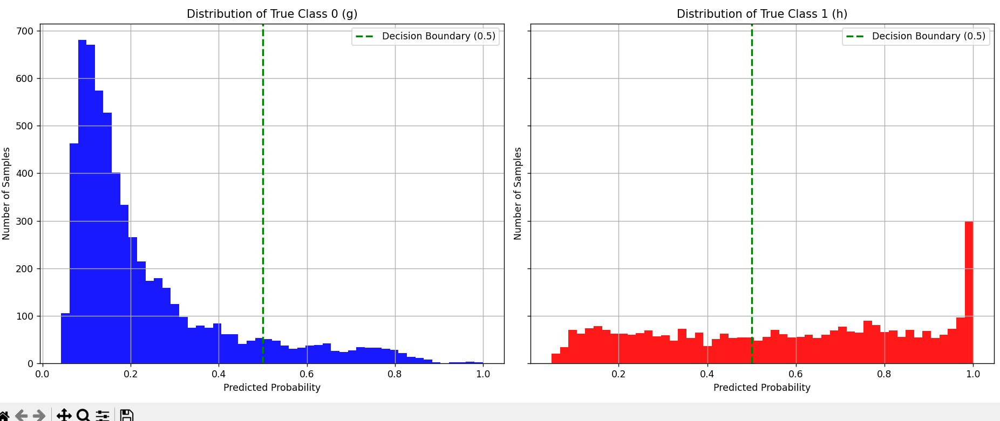

# TC3006B

## Key Concepts Implemented
**Logistic Regression**: A linear model used for binary classification.

**Sigmoid Function**: The core function that maps any real value to a probability between 0 and 1.

**Batch Gradient Descent**: An optimization algorithm used to find the optimal model parameters (weights and bias) by minimizing the cost function over the entire training dataset.

**Binary Cross-Entropy**: The loss function used to measure the performance of the classification model.

**Min-Max Normalization**: A data preprocessing technique used to scale feature values to a standard range (0 to 1).

## Prerequisites
To run this code, you need to have the following Python libraries installed:

* `numpy`
* `pandas`
* `matplotlib`

You can install them using pip:
```bash
pip install numpy pandas matplotlib
```
## Dataset 

The dataset contains the variables from the photos captured from space by the Magic Gamma Telescope located on Spain. 


### Key Aspects
* **Source**: The data is based on photos captured from space and simulated air showers using the CORSIKA software.

* **Class Imbalance**:
For technical reasons, the number of h (hadron) events is underestimated. In the real data, the h class represents the majority of the events.
This means the dataset has a class imbalance, which can be a consideration for model evaluation.

Features
The dataset includes 10 features, which are parameters characterizing the shape and orientation of the shower images. The target variable is class (g for gamma-ray and h for hadron).

## How to run the code
1. Ensure you have the `magic04.data` file in the same directory as the Python script.

2. Open your terminal or command prompt.

3. Navigate to the directory containing the project files.

4. Execute the script using the following command: 
 ```bash
python -u main.py
```

## Expected Output

When the script runs, it will display the training progress and the final results in the console.

**Console Output:**
* Initial and final model parameters (`theta` and `b`).
* The training error (Binary Cross-Entropy) printed every 100 epochs.
* The final accuracy of the model on the test dataset.

**Generated Plots:**
The script will also generate a plot with two subplots:
* A histogram showing the distribution of predicted probabilities for the **True Class 0 (gamma-ray)**.
* A histogram showing the distribution of predicted probabilities for the **True Class 1 (hadron)**.
* Both plots will include a dotted green line at `0.5`, representing the model's decision boundary.

- Ejemplo:

